# 1 单机到集群安装ambari
ambari单机到集群安装，通过VM虚拟机安装。

## 1.1 文档规范
* 代码块和vi编辑块用灰色区域标记
* $后跟的linux命令

# 2 安装准备

## 2.1 节点分配
操作系统：CentOS7.5  
节点分配如下表  

| 节点 | 组件 |
| :-----| ----: |
| hdp-master | server、agent |
| hdp01  | agent |
| hdp02  | agent |

## 2.2 网络配置

### 2.2.1 VM配置固定IP
非VM安装可跳过本步骤。
本教程使用VM的“NAT方式配置固定IP”，安装步骤参考：[Vmware虚拟机网络配置(固定IP)](https://www.jianshu.com/p/6fdbba039d79)  
虚拟机网络配置参数设置如下
~~~
# 固定IP网络参数配置
$ vi /etc/sysconfig/network-scripts/ifcfg-ens33
BOOTPROTO=static
NM_CONTROLLED=yes
IPADDR=192.168.37.1
ONBOOT=yes
NETMASK=255.255.255.0
GATEWAY=192.168.37.2
DNS1=114.114.114.119
DNS2=114.114.115.119

# 重启网卡
$ service network restart

# 验证
$ ifconfig
~~~

### 2.2.2 设置主机名和ip
~~~
# 设置主机名
3种方式查看主机名：
$ hostname
$ cat /etc/hostname 
$ hostnamectl status
master设置主机名：
$ hostnamectl set-hostname hpd-master
slave设置主机名参考master

# 编辑/etc/hosts，配置ip
vi /etc/hosts
192.168.37.1  hpd-master
192.168.37.2  hdp01
192.168.37.3  hdp02
~~~

## 2.3 时间同步
集群的时间需要配置为一致的

### 2.3.1 NTP同步时间
配置比较复杂，同步时发现操作未生效，我们机器比较少，因此使用更便捷的手动同步时间方案

### 2.3.2 手动同步时间
~~~
# 注意使用xhell全局命令，可同时设置时间，保证了多台服务器时间是一致的
$ ln -s /usr/share/zoneinfo/Asia/Shanghai /etc/localtime
执行tzselect命令 --> 选择Asia --> 选择China --> 选择Beijing -->选择yes 
$ sed -i '$a\export TZ=Asia/Shanghai' /etc/profile && source /etc/profile && date

$ timedatectl set-ntp no
$ timedatectl set-time "2019-07-24 17:41:00"
~~~

### 2.4 SSH免密登录
步骤如下：
~~~
# 所有节点生成ssh公钥和私钥
$ ssh-keygen -t rsa   #一路回车到完成
# 复制每个节点的公钥和私钥到hdp-master节点
$ ssh-copy-id -i ~/.ssh/id_rsa.pub root@hdp-master
#将复制后的公钥分发给所有节点（包括本机，单机版hdp也需做这步操作)，在hdp-master上操作，依次复制到01-05机器
$ scp ~/.ssh/authorized_keys root@hdp01:~/.ssh/ 
#公钥授权，可能要做，我这里没做，服务是正常的，命令保留参考
$ chmod 700 ~/.ssh
$ chmod 644 ~/.ssh/authorized_keys
#测试
$ ssh root@hdp01
~~~

### 2.5 关闭防火墙和关闭SELINUX
~~~
# 关闭防火墙步骤如下：
# 停止firewall
$ systemctl stop firewalld.service
# 禁止firewall开机启动
$ systemctl disable firewalld.service
# 查看默认防火墙状态（关闭后显示notrunning，开启后显示running
$ firewall-cmd --state
# 关闭selinux，注意关闭后需要重启(这里修改号后，需要重启)。
$ vim /etc/selinux/config 
SELINUX=disabled
查看selinux状态
$ sestatus -v  # SELinux status: disabled 表示已经关闭了
~~~

### 2.6 安装JDK
~~~
我们不使用系统自带的openjdk，安装下载好的jdk1.8。
# 卸载jdk
$ rpm -qa|grep jdk
# 如果有对应的jdk版本，则对其进行卸载，注意替换为实际的openjdk版本
$ rpm -e --nodeps java-1.8.0-openjdk-headless-1.8.0.161-2.b14.el7.x86_64
$ rpm -e --nodeps java-1.8.0-openjdk-1.8.0.161-2.b14.el7.x86_64

# 安装jdk1.8
解压后的java路径为/usr/local/java/jdk1.8.0_201，配置好环境变量即可。
$ vim /etc/profile
export JAVA_HOME=/usr/local/java/jdk1.8.0_201
export CLASSPATH=.:$CLASSPTAH:$JAVA_HOME/lib
export PATH=$PATH:$JAVA_HOME/bin
$ source /etc/profile    #使环境变量生效
$ java -version       #查看JDK是否安装正确
~~~

### 2.7 其他依赖安装

### 2.7.1 所有节点安装
~~~
$ yum -y install zlib zlib-devel openssl-devel gcc-c++
$ yum -y install python-lxml httpd mod_ssl cyrus-sasl-plain  cyrus-sasl-devel  cyrus-sasl-gssapi
~~~

### 2.7.2 主节点安装
主节点安装httpd服务，在配置yum局域网源时使用，用来本地安装ambari，impala等
~~~
$ yum -y install httpd
# 启动httpd服务并加到开机启动服务中：
$ service httpd start
$ chkconfig httpd on
# 启动httpd报警，解决报警【Starting httpd: httpd: Could not reliably determine the server’s fully qualified domain name, using 192.168.37.1 for ServerName】
$ vim /etc/httpd/conf/httpd.conf
#注释 ServerName www.example.com:80
#添加 ServerName localhost:80
# 重启httpd服务
$ service httpd restart
~~~

# 3 MYSQL安装
主节点安装即可，存储元数据使用

## 3.1 MYSQL安装
~~~
# 下载、解压MYSQL
$ tar -zxvf mysql-5.7.25-linux-glibc2.12-x86_64.tar.gz
$ mkdir /usr/local/mysql
$ cp -rf mysql-5.7.25-linux-glibc2.12-x86_64/* /usr/local/mysql

# 配置MSYQL环境变量
$ vim /etc/profile
MYSQL_HOME=/usr/local/mysql
PATH=$PATH:$MYSQL_HOME/bin
export PATH MYSQL_HOME
$ source /etc/profile

# 创建mysql用户和组
$ groupadd -r mysql && useradd -r -g mysql -s /sbin/nologin -M mysql

# 创建data目录
$ mkdir -p /data/mysql && cd /usr/local/mysql

#初始化mysql5.7数据库
$ ./bin/mysqld --initialize --user=mysql --datadir=/data/mysql
注意保存生成的临时密码 &bsY(o#fe0TS，然后继续执行
$ ./bin/mysql_ssl_rsa_setup --datadir=/data/mysql

# 配置文件修改
$ vi /etc/my.cnf
# These are commonly set, remove the # and set as required.
basedir=/usr/local/mysql //指定程序路径
datadir=/data/mysql //指定数据存放路径
port=3306 //指定端口号
# server_id = .....
socket=/tmp/mysql.sock //指定sock文件

# 复制启动文件并修改相关参数
$ cd /usr/local/mysql
$ cp ./support-files/mysql.server /etc/init.d/mysqld
$ vi /etc/init.d/mysqld
basedir=/usr/local/mysql //指定程序路径
datadir=/data/mysql //指定数据存放路径

# 创建日志目录
$ mkdir /var/log/mariadb 
$ touch /var/log/mariadb/mariadb.log 
$ chown -R mysql:mysql  /var/log/mariadb/

# 安装好后配置
$ chkconfig --add mysqld //加入开机启动
$ /etc/init.d/mysqld start //启动mysql服务
$ ps aux |grep mysqld // 查看mysql进程
$ netstat -ntlp | grep 3306 //查看3306端口监听情况

# 修改密码及授权远程访问
$ mysql -uroot -p'&bsY(o#fe0TS'
# set password = password('root');
# grant all privileges on *.* to 'root'@'%' identified by 'root' with grant option;
# flush privileges;

# 编码配置，防止中文乱码
$ /etc/init.d/mysqld stop
$ vi /etc/my.cnf
[mysqld]
character-set-server=utf8 
[client]
default-character-set=utf8 
[mysql]
default-character-set=utf8
$ /etc/init.d/mysqld start

# 验证编码是否已经配置好了
$ mysql -uroot -p'root'
# show variables like '%char%';
~~~

### 3.2 SQL数据库脚本安装
脚本文件为[ambari_mysql5.7.sql](./files/ambari_mysql5.7.sql)  
执行该脚本,初始化元数据即可。
~~~
$ mysql -uroot -p'root'
# source ./ambari_mysql5.7.sql
~~~ 

# 4 AMBARI安装

## 4.1 资源清单
| Type | Name | notes |
| :-----| ----: | :----: |
| Ambari | ambari-2.6.0.0-centos7.tar.gz | [down](http://public-repo-1.hortonworks.com/ambari/centos7/2.x/updates/2.6.0.0/ambari-2.6.0.0-centos7.tar.gz) |
| Hdp  | HDP-2.6.3.0-centos7-rpm.tar.gz | [down](http://public-repo-1.hortonworks.com/HDP/centos7/2.x/updates/2.6.3.0/HDP-2.6.3.0-centos7-rpm.tar.gz) |
| Hdp-utils  | HDP-UTILS-1.1.0.21-centos7.tar.gz | [down](http://public-repo-1.hortonworks.com/HDP-UTILS-1.1.0.21/repos/centos7/HDP-UTILS-1.1.0.21-centos7.tar.gz) |
| jar | postgresql-42.2.5.jar |  |
| jar | mysql-connector-java-5.1.46.jar |  |

## 4.2 AMBARI SERVER&AGENT安装
使用root用户安装，安装组件有hdfs、hbase、yarn、hive、zookeeper

### 4.2.1 制作本地源
本地源只有主节点安装，从节点通过局域网yum源安装。我们在主节点上使用了httpd将资源包通过yum源发布资源。
~~~
# 解压资源到httpd服务路径，并授权
$ tar -xzvf ambari-2.6.0.0-centos7.tar.gz -C /var/www/html/
$ tar -xzvf HDP-2.6.3.0-centos7-rpm.tar.gz -C /var/www/html/
$ mkdir /var/www/html/HDP-UTILS-1.1.0.21
$ tar -xzvf HDP-UTILS-1.1.0.21-centos7.tar.gz -C /var/www/html/HDP-UTILS-1.1.0.21/
$ chown -R root:root /var/www/html/

# web访问验证httpd
http://hdp-master/ambari/ 
~~~
资源放入httpd的/var/www/html路径下面以后，使用yum制作本地源
~~~
$ vi /etc/yum.repos.d/ambari.repo
#VERSION_NUMBER=2.6.0.0-267
[ambari-2.6.0.0]
name=ambari Version - ambari-2.6.0.0
baseurl=http://hdp-master/ambari/centos7/2.6.0.0-267
gpgcheck=1
gpgkey=http://hdp-master/ambari/centos7/2.6.0.0-267/RPM-GPG-KEY/RPM-GPG-KEY-Jenkins
enabled=1
priority=1

$ vi /etc/yum.repos.d/hdp.repo
#VERSION_NUMBER=2.6.3.0-235
[HDP-2.6.3.0]
name=HDP Version - HDP-2.6.3.0
baseurl=http://hdp-master/HDP/centos7/2.6.3.0-235
gpgcheck=1
gpgkey=http://hdp-master/HDP/centos7/2.6.3.0-235/RPM-GPG-KEY/RPM-GPG-KEY-Jenkins
enabled=1
priority=1

[HDP-UTILS-1.1.0.21]
name=HDP-UTILS Version - HDP-UTILS-1.1.0.21
baseurl=http://hdp-master/HDP-UTILS-1.1.0.21
gpgcheck=1
gpgkey=http://hdp-master/HDP-UTILS-1.1.0.21/RPM-GPG-KEY/RPM-GPG-KEY-Jenkins
enabled=1
priority=1

# 验证yum源
$ yum search ambari-agent

# yum源更新，如果验证yum源不通过，则需要此步骤
$ yum clean all
$ yum makecache
$ yum repolist
~~~
验证通过后主节点将制作好的yum源分发给从节点
~~~
$ cd /etc/yum.repos.d
$ scp ambari.repo hdp1:/etc/yum.repos.d/ambari.repo 
$ scp hdp.repo hdp1:/etc/yum.repos.d/hdp.repo
~~~

### 4.2.2 安装AMBARI AGENT
~~~
安装命令： $ yum install ambari-server -y
配置： $ ambari-server setup，进行Ambari Server的初始化，ambari server初始化的一些参数记录如下表

Customize user account for ambari-server daemon [y/n] (n)? `n`
--> 输入n，无需配置
……
Checking JDK...
[1] Oracle JDK 1.8 + Java Cryptography Extension (JCE) Policy Files 8
[2] Oracle JDK 1.7 + Java Cryptography Extension (JCE) Policy Files 7
[3] Custom JDK
============================================================
==================
Enter choice (1): 3
--> 	输入3，自定义一个JDK，输入之前配置好的JDK路径 /usr/java/default
...
Enter advanced database configuration [y/n] (n)? y
--> 输入y，自定义数据库，在数据库列表选择 [1] - PostgreSQL (Embedded)
--> 后续的配置一路回车，等待脚本初始化数据库与配置信息
database admin user: postgres
database name:ambari
postgres schema:ambari
Username:ambari
Database password:bigdata
...
Adjusting ambari-server permissions and ownership...
Ambari Server 'setup' completed successfully.
--> 到此Ambari Server安装完成。
~~~
初始化完后，我们配置ambari默认的pgsql外部可访问(如果使用默认的pg库)
~~~
$ vim /var/lib/pgsql/data/pg_hba.conf
host all all 0.0.0.0/0 trust
再配置好postgresql和mysql的驱动
$ ambari-server setup --jdbc-db=postgres --jdbc-driver=/var/lib/ambari-server/postgresql-42.2.5.jar
$ ambari-server setup --jdbc-db=mysql --jdbc-driver=/var/lib/ambari-server/mysql-connector-java-5.1.46.jar
~~~

### 4.2.4 启动SERVER
~~~
$ ambari-server start
$ tail -f /var/log/ambari-server/ambari-server.log
$ cat /var/run/ambari-server/ambari-server.pid
启动成功后，访问web端，或(netstat -apn|grep 8080)。
如：http://hdp-master:8080 ，用户名和密码默认都是admin
~~~

### 4.2.5 启动AGENT
~~~
$ ambari-agent start 
$ cat /run/ambari-agent/ambari-agent.pid
~~~

### 4.2.6 AMBARI SERVER安装组件
详细步骤略。注意装hive时，选择我们自己安装的mysql库。

登录：http://hdp-master:8080 admin/admin  
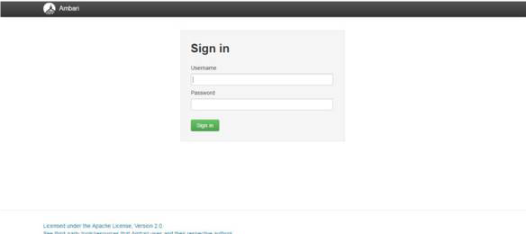  

在首页选择“Launch Install Wizard”进入安装向导  
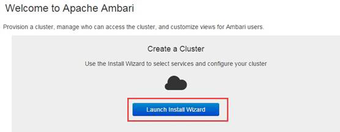 

集群命名：就是给整个集群起个名字 如hdp  
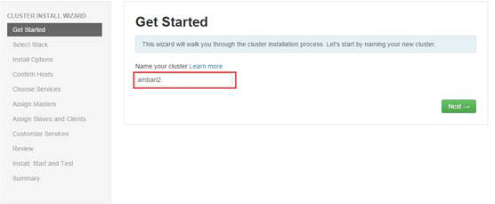 

选择HDP版本 ，这个要看你上面下载的HDP包对应的版本  
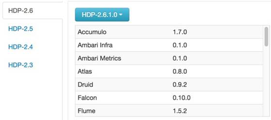

填写仓库地址,选择“use local repository”  
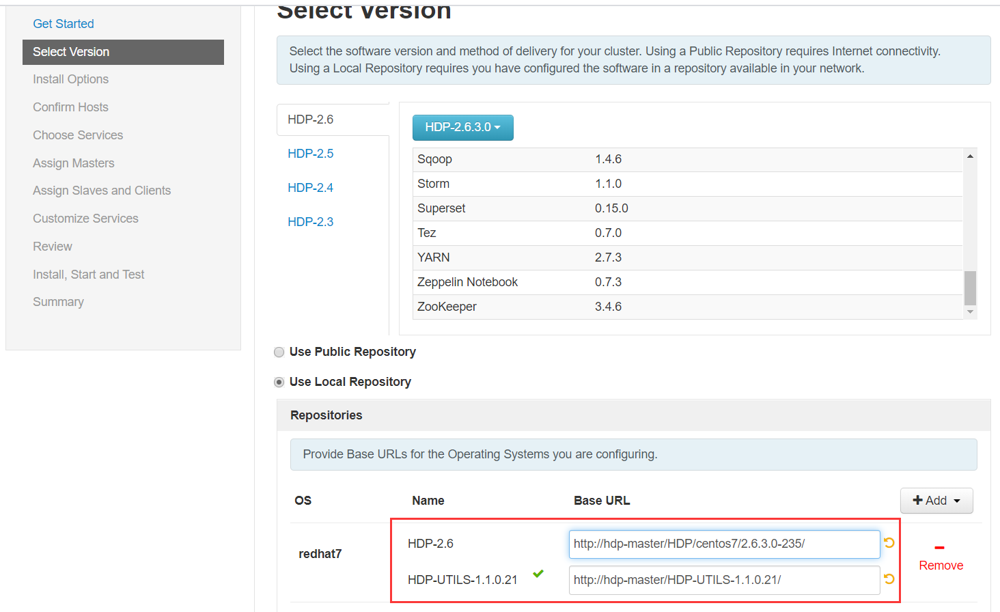

填写hostname和密钥  
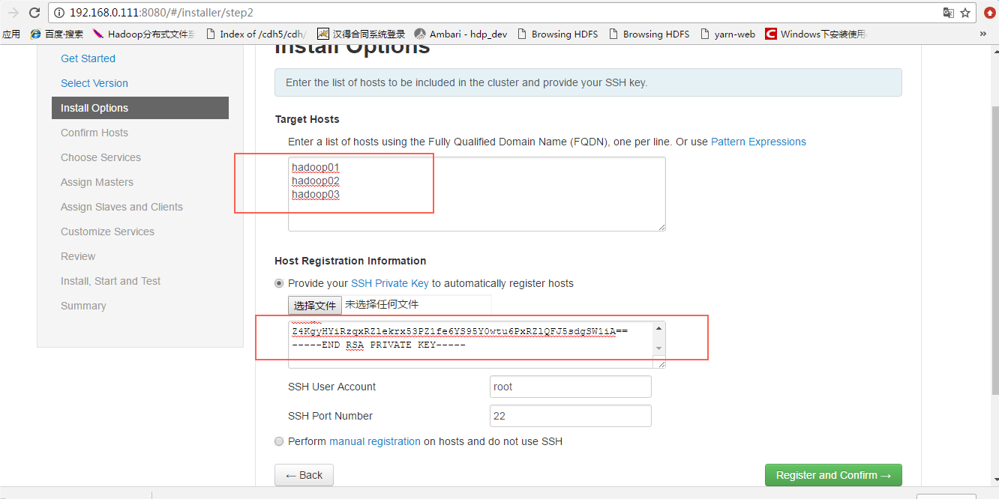

ssh秘钥路径为
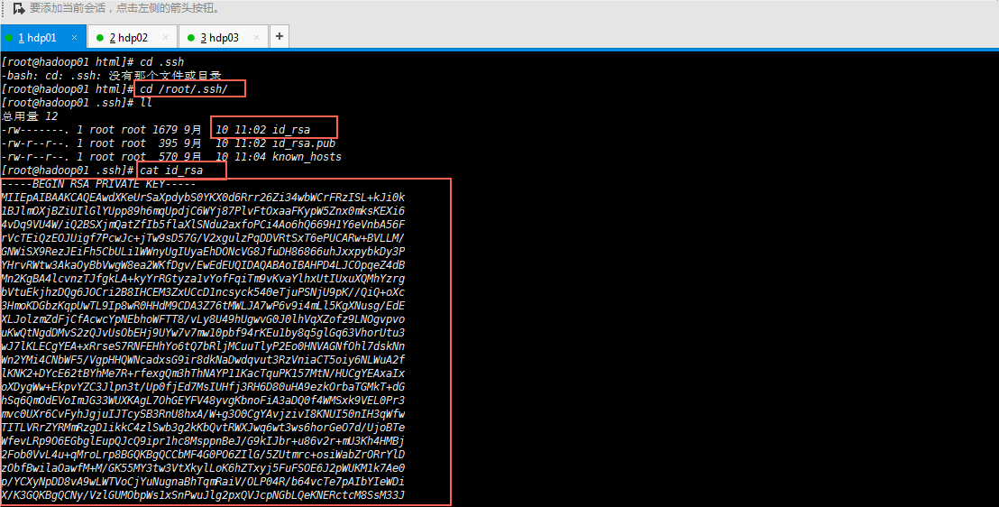

安装分配
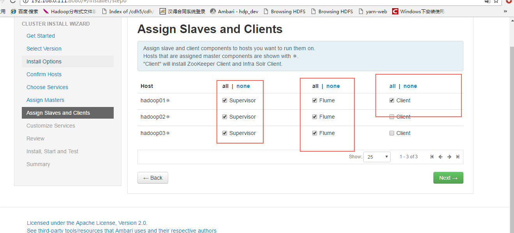

# 5 安装IMPALA
IMPALA是CDH的开源组件，ambari默认是未安装的，因此需要手动安装

## 5.1 资源清单表如下。
| Type | Name | notes |
| :-----| ----: | :----: |
| Impala | IMPALA.zip | 即ambari-imapla-service资源，ambari安装impala服务使用 |
| Impala | cdh.zip | 由cdh5.14.0-centos7.tar.gz整理而来，作为本地源离线安装cdh使用 |

[百度网盘下载地址(提取码(n4gq))](https://pan.baidu.com/s/1qTxplfimI67GVFgqaNohfw)

## 5.2 节点分配
| 节点 | 组件 | Impala组件 |
| :-----| ----: | ----: |
| hdp-master | server、agent | Impala_Catalog_Service、Impala_State_Store、Impala_Daemon |
| hdp01  | agent | Impala_Daemon |
| hdp02  | agent | Impala_Daemon |

## 5.3 安装前准备
开始安装impala前，请确保hdfs、hive、zookeeper、yarn这4个服务已经安装并已经启动好了。

## 5.4 主节点安装impala
安装好impala插件后先不重启ambari-server，后续都安装好后再重启。安装impala插件命令如下。
~~~
$ VERSION=`hdp-select status hadoop-client | sed 's/hadoop-client - \([0-9]\.[0-9]\).*/\1/'`
$ unzip IMPALA.zip -d /var/lib/ambari-server/resources/stacks/HDP/$VERSION/services
~~~

## 5.5 制作IMPALA本地源
本地源只有主节点安装，从节点通过ambari server webui操作下发安装。我们在主节点上使用了httpd将资源包通过yum源发布资源。
~~~
$ unzip cdh.zip -d /var/www/html
 
# 验证httpd
http://hdp-master/cdh/ 

# 资源放入httpd的/var/www/html路径下面以后，使用yum制作本地源
$ vi /etc/yum.repos.d/cdh_impala_repo.repo
[cdh_impala_repo]
name=cdh_impala_repo
baseurl=http://hdp-master/cdh/5.14.0
gpgkey =http://hdp-master/cdh/RPM-GPG-KEY-cloudera
gpgcheck=1 

# 验证yum源
$ yum search impala

# 主节点将制作好的yum源分发给从节点：
$ scp /etc/yum.repos.d/impala_rpms.repo root@hdp1:/etc/yum.repos.d/

# 安装好后重启ambari-server，重启命令：$ service ambari-server restart
~~~

## 5.6 WEBUI安装IMPALA
点击[ambari首页](http://hdp-master:8080)后进入ambari首页，在首页点击添加添加服务进入impala安装页面。后续对impala安装步骤进行图文安装描述
1. 选择服务。选择安装impala即可，因为impala需要的服务我们已经安装了(需要哪些服务，再“安装前准备”小节中有说明)，因此这里只会安装impala组件，如下图.  
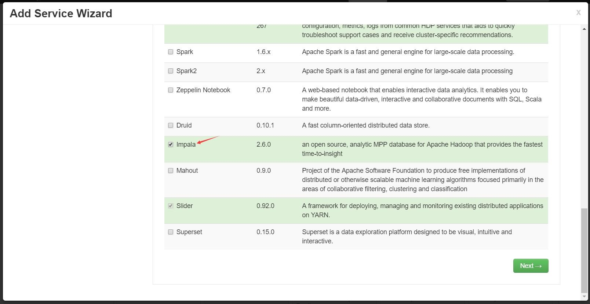

2. 主节点分配。主节点会安装Impala_Catalog_Service和Impala_State_Store，如下图.   
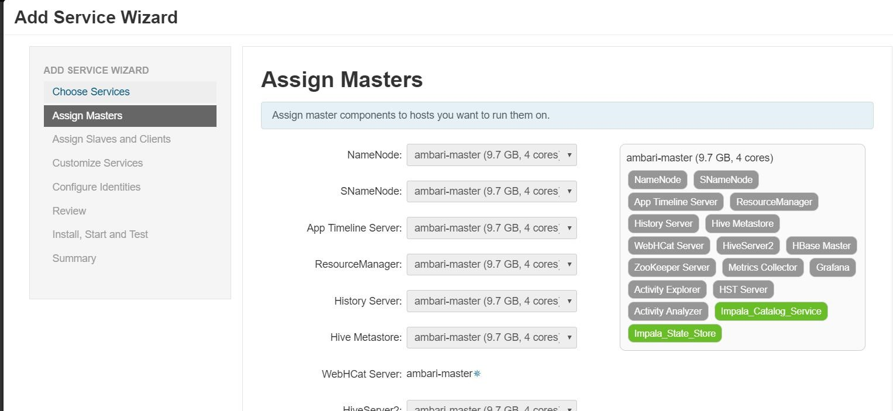

3. 从节点分配。从节点选择安装Impala Daemon，集群安装时需注意从节点需勾上Impala Daemon复选框，如下图.  
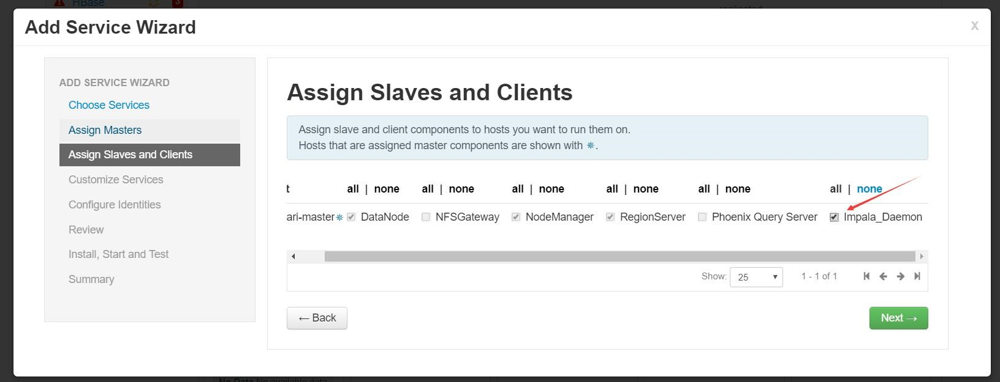

4. 自定义服务。可以配置impala的一些参数，我们使用默认参数即可，如下图.  
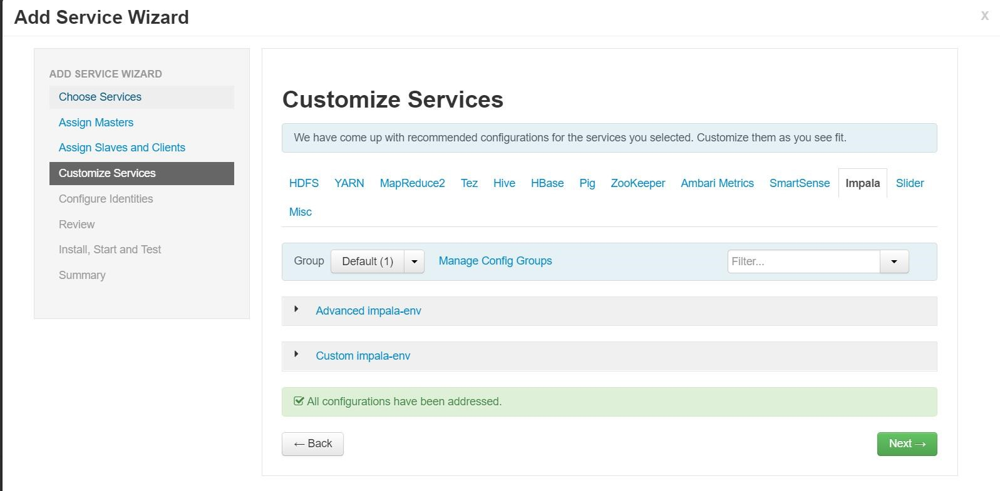

5. 安装参数检查。安装前的参数检查，有些参数警告可以忽略，如下图.  
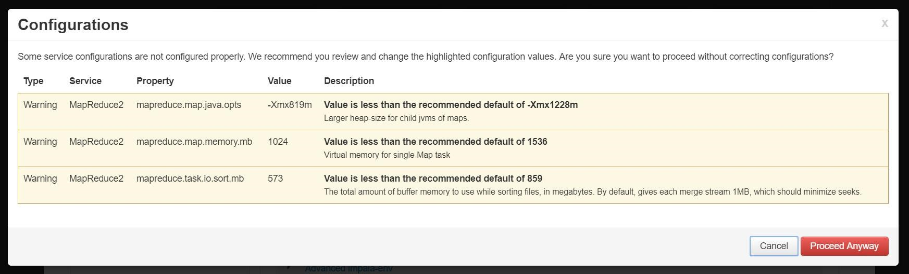

6. 安装预览。可以看到安装的impala服务分配情况，如下图.  
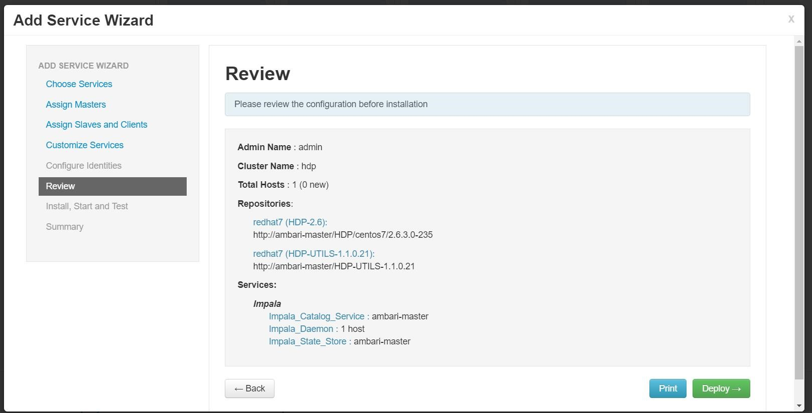

7. 安装。初始安装如下图.  
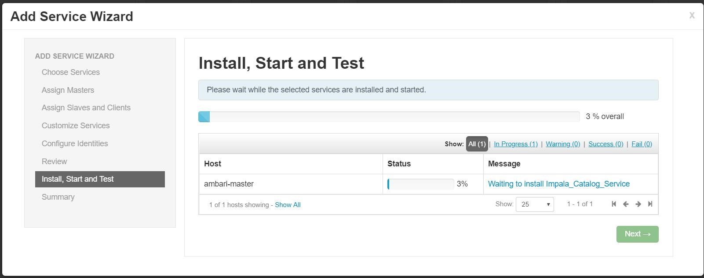

8. 因为我们配置了本地yum安装源，因此安装会比较快，稍等一会，安装完成，如下图.  
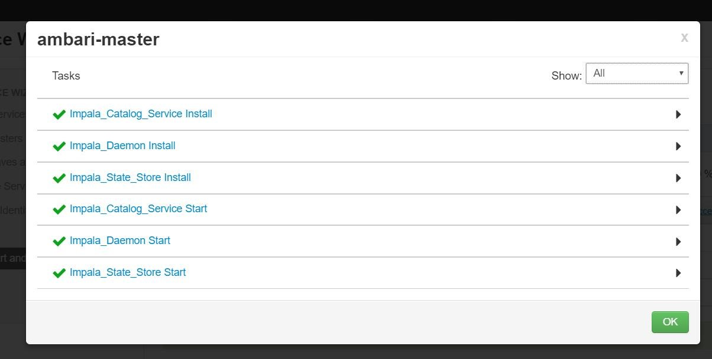

9.安装好impala后，我们需要重启下hive，hive启动成功后，再启动impala即安装成功，如下图.  
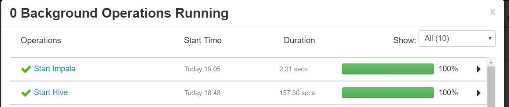

## 5.7 IMPALA卸载更新
当ambari版本和impala版本的组件不兼容时，我们需要卸载原有版本，安装新版本，一般是hive和impala组件不兼容，以cdh5.16降低到cdh5.14组件为例
~~~
# 1 删除impala服务 
ambari web页面删除impala服务

# 2 删除impala rpm，需要进入每一台impala客户端操作，以cdh5.16impala举例，先在服务器rpm查看所有cdh5.16的impala组件，再移除
$ rpm -e --nodeps solr-4.10.3+cdh5.16.2+537-1.cdh5.16.2.p0.26.el7.noarch && rpm -e --nodeps bigtop-utils-0.7.0+cdh5.16.2+0-1.cdh5.16.2.p0.22.el7.noarch && rpm -e --nodeps impala-state-store-2.12.0+cdh5.16.2+0-1.cdh5.16.2.p0.22.el7.x86_64 && rpm -e --nodeps avro-libs-1.7.6+cdh5.16.2+143-1.cdh5.16.2.p0.23.el7.noarch && rpm -e --nodeps parquet-format-2.1.0+cdh5.16.2+22-1.cdh5.16.2.p0.22.el7.noarch && rpm -e --nodeps impala-2.12.0+cdh5.16.2+0-1.cdh5.16.2.p0.22.el7.x86_64 && rpm -e --nodeps impala-shell-2.12.0+cdh5.16.2+0-1.cdh5.16.2.p0.22.el7.x86_64 && rpm -e --nodeps impala-server-2.12.0+cdh5.16.2+0-1.cdh5.16.2.p0.22.el7.x86_64 && rpm -e --nodeps hbase-1.2.0+cdh5.16.2+496-1.cdh5.16.2.p0.25.el7.x86_64 && rpm -e --nodeps impala-catalog-2.12.0+cdh5.16.2+0-1.cdh5.16.2.p0.22.el7.x86_64 && rpm -e --nodeps parquet-1.5.0+cdh5.16.2+200-1.cdh5.16.2.p0.24.el7.noarch && rpm -e --nodeps sentry-1.5.1+cdh5.16.2+573-1.cdh5.16.2.p0.23.el7.noarch

# 3 更新本地源
3.1 先删除impala-cdh5.16，命令rm -rf /var/www/html/cdh
3.2 再将新的cdh.zip 解压至/var/www/html目录，解压好的目录结构为/var/www/html/cdh
3.3 更新yum源
$ vi /etc/yum.repos.d/cdh_impala_repo.repo
[cdh_impala_repo]
name=cdh_impala_repo
baseurl=http://hdp-master/cdh/5.14.0
gpgkey =http://hdp-master/cdh/RPM-GPG-KEY-cloudera
gpgcheck=1 

# 4 添加impala服务，按原安装impala步骤安装即可
# 重启验证
4.1 重启hive
4.2 重启impala
4.3 按照测试用例验证
注意导入数据后，刷新下数据，对应的impala的刷新命令如下：# invalidate metadata;
~~~

# 6 安装异常集锦

## 6.1. SSLError
~~~
异常信息：NetUtil.py:96 - EOF occurred in violation of protocol (_ssl.c:579) NetUtil.py:97 - SSLError: Failed to connect. Please check openssl library versions.
解决办法：
$ vim /etc/ambari-agent/conf/ambari-agent.ini
在 ［security］ 增加一项
force_https_protocol=PROTOCOL_TLSv1_2
$ ambari-agent restart
~~~
