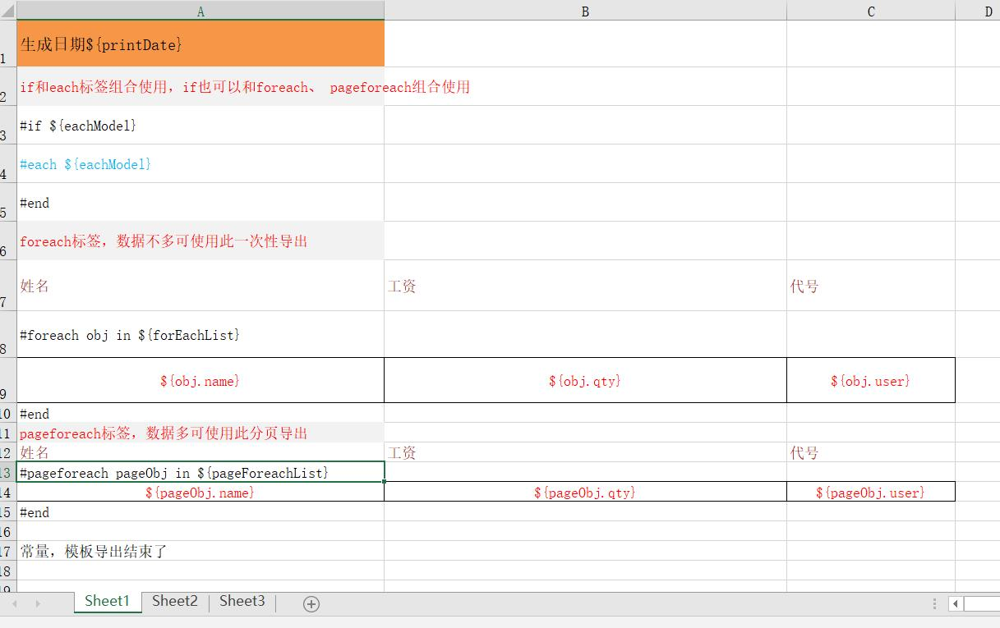
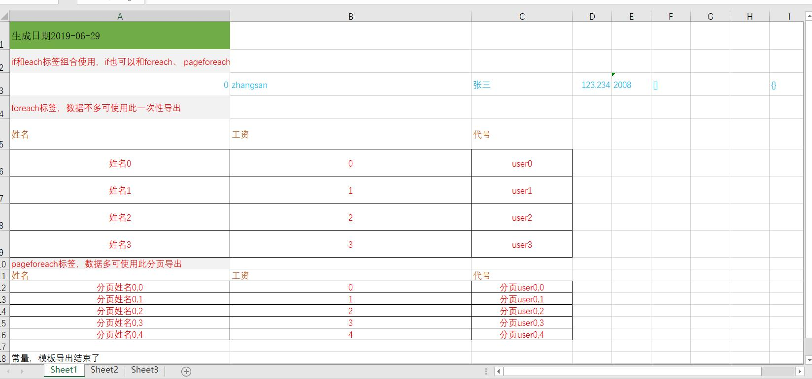

# java模板导出excel
2003excel不适合大数据分页导出，非常容易内存溢出，因此没有将模板导出poi的逻辑整合进来。2003模板导出网络上有挺多的工具包。  
2007excel模板导出，目前没发现相关工具包可用，因此重构了以前写的模板导出工具包。用户可供参考的非模板导出工具包有hutool和阿里开源的eashexcel，具体区别不在此分析。

## 功能描述
* 目前仅支持简单的表达式替换导出数据功能。其他有合并单元格，公式，图片等都未处理
* 只需配置好2007excel模板，自动替换指定的模板变量为具体数据，自动导出excel
* 自定义了部分表达式标签，支持if，迭代，循环语法，分页导出等

### 支持标签
* if标签，如果表达式值为空，则if标签块内容不输出。eq: ~#if ${eachModel}~
* each标签，可以嵌套配合if、foreach、pageforeach使用，迭代输出对象或map的key数据。eq: ~#each ${eachModel}~
* foreach标签，一次性将所有数据遍历处理，将foreach块循环输出。eq: ~#foreach obj in ${forEachList}~
* pageforeach标签，可解决内存溢出问题，分页读取数据遍历处理，将pageforeach块循环输出。eq: ~#pageforeach pageObj in ${pageForeachList}~

## 使用步骤
* mvn导入，主要依赖如下，其他的依赖是可选的，参考”sstool模板导出2007excel的demo“导入
~~~ 
<dependency>
	<groupId>com.github.shaohj</groupId>
	<artifactId>sstool-all</artifactId>
	<version>1.0.1</version>
</dependency>
~~~
* 配置2007excel模板
* 编码导出，主要是封装模板导出excel需要的参数，配置模板路径，导出路径等，详见demo

### 核心部分介绍
模板文件信息如下：  
 

导出核心参数代码如下
~~~ 
@Builder(toBuilder = true)
@Getter
@Setter
public class Sax07ExcelExportParam {
    /** 模板文件路径是否为class路径.true:是;false:否 */
    private boolean tempIsClassPath;
    /** 模板文件名称 */
    private String tempFileName;
    /** 导出java参数 */
    private Map<String, Object> params;
    /** 输出文件流 */
    private OutputStream outputStream;
    /** 分页导出处理service，支持多页分页导出 */
    private List<Sax07ExcelPageWriteService> sax07ExcelPageWriteServices;
}
~~~

含4种标签的导出demo代码如下，举例用因此导出数据少了些，实际测试时配置8M的JVM可以导出百万级数据，不会出现内存溢出，只是大部分的时间都在进行gc
~~~
@Test
public void exportSstoolTest(){
	int pageSize = 10;
	int pageForeachTotalNum = 5;
	int totalPageNum = pageForeachTotalNum % pageSize == 0 ? pageForeachTotalNum/pageSize : pageForeachTotalNum/pageSize + 1;
	// 使用类classpath路径下的模板文件导出
	String tempPath = "xlsx/";

	Map<String, Object> params = new HashMap<>();

	// 普通数据mock
	params.put("printDate", "2019-06-29");

	// each数据mock
	ModelTest eachModel = new ModelTest("张三", "zhangsan", 123.234);
	eachModel.setYear("2008");
	params.put("eachModel", eachModel);

	// foreach数据mock
	List forEachList = new ArrayList();
	for(int i = 0; i< 4; i++){
		forEachList.add(new ModelTest("姓名" + i, "user" + i, i));
	}
	params.put("forEachList", forEachList);

	// 分页导出数据mock
	Sax07ExcelPageWriteService sax07ExcelPageWriteService = new Sax07ExcelPageWriteService(){
		@Override
		public void pageWriteData() {
			for (int i = 0; i <totalPageNum; i++) {
				Map<String, Object> pageParams = new HashMap<>();
				List pageForeachList = new ArrayList(pageSize);
				for (int j = 0; j <pageSize && pageSize * i + j < pageForeachTotalNum; j++) {
					pageForeachList.add(new ModelTest("分页姓名" + i + "," + j, "分页user" + i + "," + j, j));
				}
				pageParams.put("pageForeachList", pageForeachList);
				tagData.writeTagData(writeWb, writeSheet, writeSheetData, pageParams, writeCellStyleCache);
			}
		}
	};
	//设置sax07ExcelPageWriteService对应的表达式
	sax07ExcelPageWriteService.setExprVal("#pageforeach pageObj in ${pageForeachList}");

	CostTimeUtil.apply(null, "导出" + pageForeachTotalNum + "条数据,耗费时间为{}毫秒", s -> {
		try (FileOutputStream fos = new FileOutputStream(exportPath + "sstool_demo_data.xlsx");){
			Sax07ExcelExportParam param = Sax07ExcelExportParam.builder()
					.tempIsClassPath(true)
					.tempFileName(tempPath + "sstool_demo_temp.xlsx")
					.params(params)
					.sax07ExcelPageWriteServices(Arrays.asList(sax07ExcelPageWriteService))
					.outputStream(fos).build();
			Sax07ExcelUtil.export(param);
		} catch (Exception e) {
			e.printStackTrace();
		}
	});
}
~~~

模板导出结果如下：
  

## 缺陷
暂无记录，若发现了其他问题，可以提到issue里面。

### 代码地址
[sstool源码](https://github.com/shaohj/sstool)
[sstool模板导出2007excel的demo](https://github.com/shaohj/felix-space/tree/master/codes/sstool-demo)